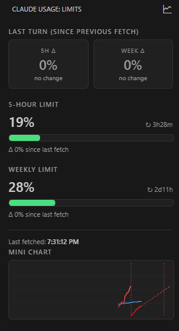

# Claude Code Telemetry

[](LICENSE) [](https://github.com/Avhatar/ClaudeCodeVsCodeStatisticsPlugin)

An open-source VS Code dashboard for your Claude Code subscription. See your 5-hour and weekly limits with **predicted reset times**, per-turn token counts and **USD spend** calculated from Anthropic's published pricing, **usage forecasts** to your projected exhaustion point, and the full historical timeline — all without the editor ever calling an API itself.

The extension is a passive reader of `~/.claude/usage-log.txt`, which is populated by a small Stop hook that the extension can install for you. All data stays on your machine.

This started as an open-source side project for friends and coworkers who use Claude Code daily. It turned out useful enough that publishing it more broadly seemed worth doing.

> Internal package id (`claude-usage-monitor`), settings prefix (`claudeUsage.*`), command ids and existing on-disk state stay unchanged across the rename — only the Marketplace display name moved.

## Features

- **Sidebar view** with:
  - Live 5-hour limit, weekly limit, and last-turn delta cards.
  - Per-turn and per-window USD cost (computed locally from a bundled `pricing.json`).
  - "New window" indicator when the parser detects a 5h/weekly window flip between two fetches (no more bogus `+56%` deltas across windows).
  - Mini limits chart and mini tokens chart, both clickable to open the matching full-size panel.
  - Settings dropdown at the bottom for sidebar-controlled toggles (USD annotations, VS Code theme skin, ignore bugged API data).
- **Status bar** indicator: `<icon> NN% (+ΔN%), MM% (+ΔM%)` — shows `(reset)` instead of a number when a new window just started.
- **Limits chart panel** with:
  - Free-form day-range input (`1`, `2`, `7`, `(3)`, `1-7`, `3-7`).
  - Gradient lines whose color saturates from "almost empty" to "almost out".
  - Vertical markers for actual and predicted limit resets, including parser-flagged window flips.
  - Suppressed bugged-API readings shown in magenta with an explanatory tooltip (when "Ignore bugged API data" is on).
  - Day-boundary verticals when the window spans more than one day.
  - Optional linear forecast to the projected exhaustion point.
  - "Focus on data" zoom that crops empty leading/trailing time.
  - Optional VS Code theme skin (off = locked dark palette).
  - Drag-to-select a range to see total Δ for both windows over the selection.
  - User-configurable colors for both gradients (persisted across reloads).
- **Tokens chart panel** with:
  - Stacked bars per turn — input, output, cache-write, cache-read — with semantic colors.
  - Y-axis modes: linear tokens, log tokens, USD cost (per-turn dollar amount using the bundled pricing table).
  - Same range syntax, gap break, focus-on-data, day-boundary verticals, and drag-to-select range summary as the limits chart.
  - Tooltip shows tokens, USD, and the model used for that turn.
- **Daily summary** view (markdown) with per-day spend totals, peaks, and reset counts.
- **Bundled Stop hook** with one-click installation. The extension can deploy, update, and register the hook in `~/.claude/settings.json` for you. The hook reads the local transcript file to capture per-turn token counts and the model id, so cost calculations stay accurate without any extra network calls.

## Screenshots




## Requirements

- **Claude Code** installed and signed in (`/login`). The extension reads `~/.claude/.credentials.json` indirectly through the Stop hook — never directly.
- **Node.js** on `PATH`. The Stop hook is a small Node script invoked by Claude Code on each `Stop` event.
- **VS Code 1.85+**.
- Tested on Windows. The Stop hook is plain Node and should work on macOS / Linux as well, though paths in the documentation use Windows separators.

## Installation

### From a `.vsix`

```bash
code --install-extension claude-usage-monitor-<version>.vsix
```

Then run `Developer: Reload Window` (the command palette is `Ctrl+Shift+P` / `Cmd+Shift+P`). VS Code does not auto-reload extensions on update.

### Setting up the Stop hook

After install, the extension prompts on first activation:

> Claude Usage Monitor: install Stop hook so the plugin can track API usage?

Pick **Install hook**. The extension will:

1. Copy `media/hooks/claude-usage-monitor-hook.js` to `~/.claude/hooks/`.
2. Add an entry under `hooks.Stop[]` in `~/.claude/settings.json`.

Make a single turn in Claude Code; the log file `~/.claude/usage-log.txt` will start populating, and the sidebar will show usage immediately.

If you already have your own Stop hook that writes to the same log file (in the parser-compatible format), the prompt is suppressed to avoid double API calls. You can still run `Claude Usage: Install Stop hook` manually.

## Quick start

1. Install extension and reload window.
2. Click the **Claude Usage** icon in the Activity Bar.
3. If prompted, install the Stop hook.
4. Run a turn in Claude Code.
5. Click the line-chart icon in the sidebar header (or run `Claude Usage: Show chart`) to open the limits chart, or the numeric icon next to it (or `Claude Usage: Show tokens chart`) for the tokens chart.

## Settings

| Setting | Default | Description |
|---|---|---|
| `claudeUsage.logPath` | `~/.claude/usage-log.txt` | Override path to the usage log file. Empty = auto-detect. |

Chart options (day range, gap, gradient colors, forecast, focus, Y-axis mode, etc.) live inside each chart panel and persist via `vscode.setState` — scoped to that webview, not to VS Code settings. The chart panels also push their settings to extension `globalState` so the sidebar mini charts can mirror them. Sidebar-only toggles (USD annotations, VS Code theme skin) live in the settings dropdown at the bottom of the sidebar.

## Commands

All commands are available via `Ctrl+Shift+P` / `Cmd+Shift+P`.

| Command | Description |
|---|---|
| `Claude Usage: Refresh now` | Re-read the log immediately. |
| `Claude Usage: Show chart` | Open the limits chart in a side panel. |
| `Claude Usage: Show tokens chart` | Open the per-turn tokens / cost chart in a side panel. |
| `Claude Usage: Show daily summary` | Markdown table of per-day spend. |
| `Claude Usage: Open usage-log.txt` | Open the raw log file. |
| `Claude Usage: Open pricing.json` | Open the bundled per-model pricing table used for USD calculations. |
| `Claude Usage: Show plugin log` | Open the extension's diagnostic Output channel. |
| `Claude Usage: Install Stop hook` | Deploy and register the bundled hook. |
| `Claude Usage: Update Stop hook to bundled version` | Overwrite an outdated registered hook with the bundled one. |
| `Claude Usage: Remove Stop hook` | Unregister the hook (with optional script delete). |
| `Claude Usage: Show hook status` | Modal showing hook installation status. |
| `Claude Usage: Show hook invocation log` | Open the per-fire diagnostic log written by the hook. |

## How it works

```
Claude Code  ── Stop event ──▶  Stop hook (Node script)  ──appendFileSync──▶  ~/.claude/usage-log.txt
                                       │                                              │
                                       ▼                                              ▼
                              GET /api/oauth/usage                            VS Code extension reads it
                              (Anthropic OAuth API)                           (fs.watch + parser)
```

The extension itself **never opens an HTTP connection**. Only the Stop hook reaches out, and it does so once per assistant turn (event-driven, not polled). When the hook fails to reach the API (timeout, 429, network), it falls back to writing the most recent valid percent values with a `src=stale-api-fail` tag, so the timeline doesn't lose the point.

The parser in the extension handles both our hook's lines and the legacy `limits: n/a (HTTP 429)` shape from older third-party hooks; in either case it carries forward the last known good values for stale rows.

## Privacy

- The extension does **not** make any network requests.
- The Stop hook makes a single GET request to `https://api.anthropic.com/api/oauth/usage` per assistant turn, using your own OAuth token from `~/.claude/.credentials.json`. Nothing else is sent. No telemetry.
- The hook also reads the local Claude Code transcript (`transcript_path`, passed to it on the Stop event) to extract per-turn token counts and the model id. This read is purely local — the transcript is not sent anywhere.
- All historical data is stored locally in plain text at `~/.claude/usage-log.txt`. The file is append-only and never rotated or deleted by the extension. You can inspect, copy, or delete it at any time.
- A small per-fire diagnostic log lives at `~/.claude/claude-usage-monitor-hook.invocations.log`; it self-rotates past 100 KB.
- Chart and sidebar UI state (selected day range, gradient colors, Y-axis mode, USD-annotation toggle, theme skin, etc.) lives in VS Code's per-extension `webviewState` and `globalState` — also entirely local.

## Troubleshooting

**Sidebar / chart shows "no-log" or "empty-log".**
Either the Stop hook isn't installed, or no turn has fired yet. Run `Claude Usage: Show hook status` to verify, and `Claude Usage: Install Stop hook` if needed. Then make any turn in Claude Code.

**I installed a new version but nothing changed.**
VS Code does not reload installed extensions automatically when you run `code --install-extension`. Run `Developer: Reload Window`. If a chart panel was open, close and reopen it — webviews retain their state across reloads.

**Chart says "Invalid range" for an obvious input like `1`.**
Open and re-open the chart panel after a reload. If the issue persists, the persisted webview state may be corrupted; uninstall and reinstall the extension to reset it.

**Hook installed but the log file is never created.**
The most common cause is a stale Claude Code session that was already running before the hook was registered. `Developer: Reload Window` reloads VS Code extensions but does not always restart the Claude Code process underneath. Fully close Claude Code (or the IDE) and reopen, then make any turn.

If the file still isn't appearing, check the **invocation log**: run `Claude Usage: Show hook invocation log`. Each Stop event appends one line there with the hook's status (`token=present`, `api-http=429`, `wrote=101b`, etc.). If the log doesn't exist or hasn't grown after a turn, Claude Code isn't calling our hook — verify with `Claude Usage: Show hook status`. If the log grows but with `mode=skip-…` lines, see what the reason is (no token, no history, API down) and fix accordingly.

**The Stop hook doesn't seem to fire on every turn.**
Some turn types (interruptions, certain agent loops) may not trigger a `Stop` event. The extension's parser is resilient to gaps and rate-limit failures, so missing the occasional turn is fine.

**Two Stop hooks are writing to the log.**
If you already had a hook before installing ours, both will run on each `Stop`, doubling API calls. Use `Claude Usage: Remove Stop hook` to drop ours, or remove the older one from `~/.claude/settings.json` manually.

## Architecture / Contributing

See [DEV-NOTES.md](./DEV-NOTES.md) for the full architecture write-up, file map, gotchas (regex backslashes inside template literals!), and version history rationale.

To work on the extension locally:

```bash
git clone <this-repo>
cd claude-usage-monitor
npm install
npm run compile     # one-shot
# or
npm run watch       # continuous

# Press F5 in VS Code to launch an Extension Development Host.
```

Packaging:

```bash
npx @vscode/vsce package --skip-license --allow-missing-repository --readme-path README.marketplace.md
code --install-extension claude-usage-monitor-<version>.vsix --force
```

The `--readme-path README.marketplace.md` flag tells `vsce` to use the slimmer user-facing README on the Marketplace details page. This file lives alongside `README.md` (which is what GitHub renders and what you're reading now). When changing user-visible features or commands, **update both READMEs** — the marketplace one is the only thing extension users will read before installing.

Issues, ideas, and pull requests welcome.

## Changelog

User-facing summary: [CHANGELOG.md](./CHANGELOG.md). Detailed per-version notebook with root causes and internals: [DevChangelog.md](./DevChangelog.md). The 0.x range was developed iteratively in a single session and is intentionally fine-grained.

## License

See [LICENSE](./LICENSE).
